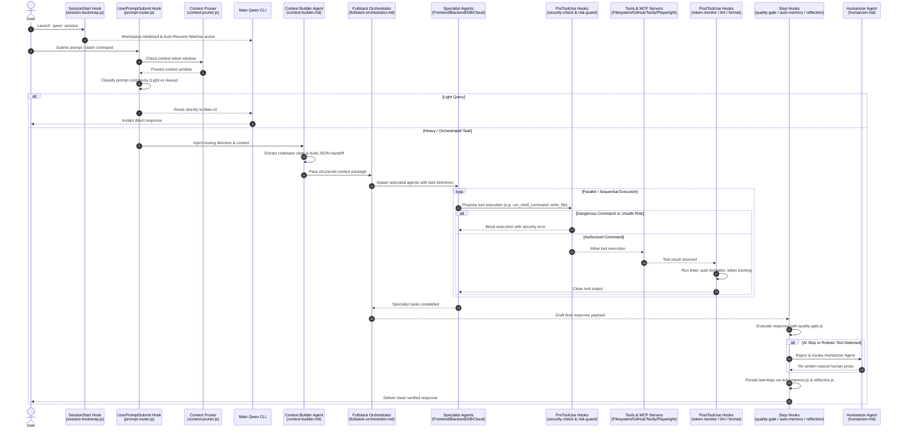

# System Workflow & Data Flow

The **Universal Qwen Agentic Harness** operates on an event-driven **Orchestrator-Worker** paradigm powered by native Qwen Code **Lifecycle Hooks** acting as the central nervous system.

---

## End-to-End System Sequence Diagram

---

## Detailed Step-by-Step Execution Lifecycle

### Phase 1: Session Initialization (`SessionStart`)

1. **Workspace Setup (`session-bootstrap.js`)**: Runs upon starting the CLI. Verifies directory layout, validates environment variables, and confirms MCP server accessibility.
2. **Auto-Resume Watcher (`core/auto-resume-watcher.js`)**: Starts a background monitor watching `tmp/blackboard.json`. If a previous task stalled or was rate-limited, it automatically waits out the cooldown and injects `[SYSTEM AUTO-RESUME]` prompts to continue execution.

### Phase 2: Interception & Auto-Routing (`UserPromptSubmit`)

1. **Context Window Pruning (`context-pruner.js`)**: Scans conversation history length and trims stale tokens, maintaining optimal context headroom.
2. **Intent Classification & Routing (`prompt-router.js`)**: Analyzes user prompt against 40+ keyword routing patterns:
   - **Light Query** (e.g., "Explain REST APIs"): Bypasses multi-agent orchestration, answering directly.
   - **Heavy Task** (e.g., "Build a full-stack SaaS app with Next.js and PostgreSQL"): Automatically injects routing directives and delegates to `fullstack-orchestrator`.

### Phase 3: Auto Prompting & Context Handoff

1. **Context Building (`agents/context-builder.md`)**: Analyzes current directory files, Git state, and active requirements. Generates a concise `< 500 word` summary and exports a structured JSON handoff (`handoff-schema.json`).
2. **Prompt Optimization (`core/prompt-optimizer.js`)**: Strips fluff and politeness phrases, injects active coding rules (`rules/_universal/`), attaches relevant long-term memories (`.qwen/memories/`), and calculates strict token budgets.
3. **Task Delegation**: The `fullstack-orchestrator` spawns background sub-agents (`database-architect`, `backend-engineer`, `frontend-engineer`, `cloud-architect`) via `agent` tool calls.

### Phase 4: Specialist Execution, Skills, & MCPs

1. **Skill Directives**: Sub-agents load specialized rules from `.qwen/skills/` (e.g., `frontend-react-tailwind`, `backend-api-design`, `cybersecurity-pentest`).
2. **MCP Tool Operations**:
   - External Research: `web-researcher` calls **Tavily**, **Exa**, or **Brave Search** MCP.
   - File & Code I/O: `backend-engineer` calls **Filesystem** or **GitHub** MCP.
   - Browser & E2E Testing: `quality-gatekeeper` calls **Playwright** MCP for visual snapshots and DOM evaluation.
   - Library Documentation: Agents query **Context7 MCP** for live package API specs.

### Phase 5: Security & Risk Guarding (`PreToolUse`)

1. **Shell Command Firewall (`security-check.js`)**: Intercepts `run_shell_command` calls. Blocks destructive commands (`rm -rf /`, `git push --force`, `curl | sh`, raw disk formatting).
2. **Trading & Financial Guard (`trading-risk-guard.js`)**: Intercepts automated financial executions. Enforces position sizing limits, stop-loss checks, and blocks unauthorized live trades without manual confirmation flags.

### Phase 6: Post-Tool Processing (`PostToolUse`)

1. **Token Tracking (`token-monitor.js`)**: Logs per-turn input/output token usage.
2. **Auto-Linting (`lint-check.js`)**: Runs linter checks automatically whenever `write_file` or `edit` modifies code.
3. **Auto-Formatting (`auto-format.js`)**: Normalizes indentation, quotes, and imports to match project conventions.

### Phase 7: Display Filtering (`MessageDisplay` & `SubagentStart`)

1. **Parent Noise Suppression (`parent-silencer.js`)**: Silences verbose internal logs from sub-agents to keep the main user terminal clean.
2. **Output Sanitization (`output-sanitizer.js`)**: Strips raw tool call payloads and JSON dumps from user-visible outputs.
3. **Sub-Agent Formatting (`subagent-presenter.js`)**: Formats sub-agent progress notifications cleanly.

### Phase 8: Quality Gate, Auto Evaluation & Memory (`Stop`)

1. **Anti-Slop Quality Gate (`quality-gate.js`)**: Scans final responses for generic AI boilerplate ("Certainly!", "Here is your code..."). If detected, blocks delivery and delegates to `humanizer` agent for natural rewriting.
2. **Hallucination Detection (`hallucination-guard.js`)**: Verifies quoted URLs, file paths, and facts against actual system state.
3. **Auto Evaluation (`agents/self-evaluator.md` & `core/eval-runner.js`)**: Assesses deliverables against original prompt requirements.
4. **Auto-Memory Persistence (`auto-memory.js`)**: Automatically extracts architectural decisions, user preferences, and bug fixes, saving them to `.qwen/memories/` or `.qwen/projects/`.
5. **System Improvement Tracking (`improvement-tracker.js` & `protocol-updater.js`)**: Logs system enhancements and updates protocol documentation automatically.
6. **Session Reflection (`reflection.js`)**: Performs end-of-session performance analysis.

### Phase 9: Context Compression (`PreCompact`)

1. **Memory Distiller (`memory-distiller.py`)**: Executed right before context compaction. Distills critical context into permanent memory files before conversation history is truncated.

---

## Complete Hook Execution Matrix

| Hook Name                | Qwen Lifecycle Event | Matcher Target      | Timeout | Primary Function                                           |
| :----------------------- | :------------------- | :------------------ | :-----: | :--------------------------------------------------------- |
| `session-bootstrap.js`   | `SessionStart`       | All                 | 10000ms | Initializes session environment & environment variables    |
| `auto-resume-watcher.js` | `SessionStart`       | All                 | 10000ms | Monitors background stalls and injects auto-resume prompts |
| `context-pruner.js`      | `UserPromptSubmit`   | All                 | 5000ms  | Prunes context tokens before prompt execution              |
| `prompt-router.js`       | `UserPromptSubmit`   | All                 | 15000ms | Analyzes prompt complexity and injects routing directives  |
| `security-check.js`      | `PreToolUse`         | `run_shell_command` | 5000ms  | Blocks destructive terminal commands                       |
| `trading-risk-guard.js`  | `PreToolUse`         | `run_shell_command` | 5000ms  | Enforces trading limits and position risk controls         |
| `token-monitor.js`       | `PostToolUse`        | `*`                 | 5000ms  | Measures token consumption on every turn                   |
| `lint-check.js`          | `PostToolUse`        | `write_file`        | 5000ms  | Runs linter checks after file modifications                |
| `auto-format.js`         | `PostToolUse`        | `write_file`        | 5000ms  | Auto-formats edited files to project style                 |
| `parent-silencer.js`     | `MessageDisplay`     | All                 | 5000ms  | Filters parent conversation noise during sub-agent runs    |
| `output-sanitizer.js`    | `MessageDisplay`     | All                 | 5000ms  | Cleans raw MCP/tool JSON dumps from output                 |
| `subagent-presenter.js`  | `SubagentStart`      | All                 | 5000ms  | Formats sub-agent start/progress notifications             |
| `hallucination-guard.js` | `Stop`               | All                 | 5000ms  | Flags ungrounded claims, non-existent URLs, or code bugs   |
| `quality-gate.js`        | `Stop`               | All                 | 10000ms | Rejects robotic AI slop phrasing and forces humanization   |
| `auto-memory.js`         | `Stop`               | All                 | 10000ms | Persists key learnings to long-term memory                 |
| `improvement-tracker.js` | `Stop`               | All                 | 10000ms | Logs continuous system improvements                        |
| `protocol-updater.js`    | `Stop`               | All                 |    —    | Syncs protocol documentation with codebase updates         |
| `reflection.js`          | `Stop`               | All                 | 10000ms | Conducts end-of-turn session reflection                    |
| `memory-distiller.py`    | `PreCompact`         | All                 | 15000ms | Distills context into structured memory before compaction  |

---

## Agent Delegation Matrix

| Primary Agent / Command  | Delegated Sub-Agents                                                                                | Typical Trigger Scenario                          |
| :----------------------- | :-------------------------------------------------------------------------------------------------- | :------------------------------------------------ |
| `fullstack-orchestrator` | `database-architect`, `backend-engineer`, `frontend-engineer`, `mobile-developer`, `ui-ux-designer` | Complete full-stack web/mobile application builds |
| `fullstack-orchestrator` | `cloud-architect`, `devops-engineer`, `network-engineer`                                            | Infrastructure provisioning and CI/CD setup       |
| `trading-desk-chief`     | `quant-strategist`, `quant-algo-engineer`, `finance-analyst`, `risk-manager`                        | Quantitative strategy design and backtesting      |
| `team-commander`         | Any specialized sub-agent pool                                                                      | Complex multi-domain engineering tasks            |
| `context-builder`        | `web-researcher`, `news-trending-scout`                                                             | Context gathering and requirement extraction      |
| `code-reviewer`          | `cybersecurity-analyst`, `refactor-engineer`                                                        | Automated code review, security, and refactoring  |

---

## MCP Server Routing Matrix

| Agent Role              | Primary MCP Server | Fallback / Secondary MCP              |
| :---------------------- | :----------------- | :------------------------------------ |
| `web-researcher`        | `tavily`           | `exa`, `brave-search`, `web-research` |
| `quant-strategist`      | `exa`              | `tavily`, `fetch`                     |
| `backend-engineer`      | `filesystem`       | `github`, `context7`                  |
| `frontend-engineer`     | `magic`            | `context7`, `playwright`              |
| `devops-engineer`       | `vercel`           | `filesystem`, `github`                |
| `cybersecurity-analyst` | `firecrawl`        | `tavily`, `web-research`              |
| `quality-gatekeeper`    | `playwright`       | `filesystem`                          |
| `memory-curator`        | `memory`           | `filesystem`                          |
