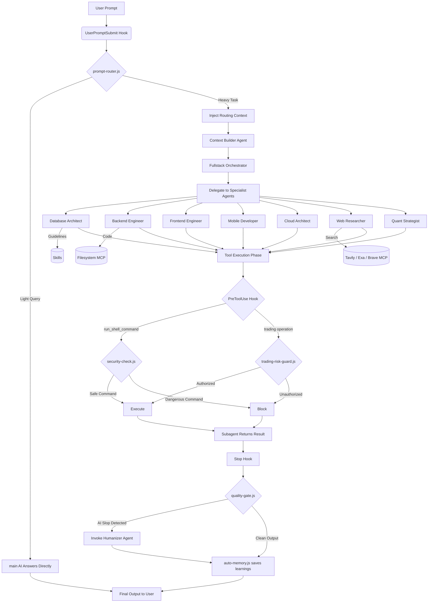

# System Workflow & Data Flow

Event-driven **Orchestrator-Worker** architecture with native Qwen Code **Hooks** as the central nervous system.

---

## Architecture Flowchart



---

## Step-by-Step Workflow

### 1. Input & Routing (UserPromptSubmit)

**prompt-router.js** intercepts before main AI processes:

- **Light Prompts** (e.g., "What is Python?"): Direct AI answer, saving tokens.
- **Heavy Prompts** (e.g., "Build a website with database"): Injects `AdditionalContext` for Orchestrator mode.

### 2. Context Building & Delegation

**fullstack-orchestrator** reads injected context:

- Invokes **context-builder** to scan project and extract requirements.
- Spawns specialist sub-agents (`database-architect`, `backend-engineer`, `cloud-architect`, `quant-strategist`) via Task tool.

### 3. Execution, Skills, & MCPs

Specialist agents execute:

- **Skills:** Read `SKILL.md` from `.qwen/skills/` for technical guidelines.
- **MCPs:** External data access:
  - `web-researcher` → **Tavily MCP** for news
  - `backend-engineer` → **Filesystem MCP** for code I/O
  - `quant-strategist` → **Exa MCP** for research
  - **Playwright MCP** for browser automation

### 4. Security Guards (PreToolUse)

#### 4.1 Command Security

**security-check.js** intercepts terminal commands:

- Blocklist: `rm -rf /`, `git push --force`, `curl* | sh`
- Safe → `Allow`, Dangerous → `deny`

#### 4.2 Trading Risk Guard

**trading-risk-guard.js** validates:

- Position size vs risk tolerance
- Stop-loss/take-profit params
- Explicit user confirmation
- Circuit breaker conditions

### 5. Quality Gate & Humanizer (Stop)

**quality-gate.js** on `Stop` event:

- Detects "AI Slop" (_"Here is your code..."_, _"Certainly!"_)
- **Slop detected:** Block → **humanizer** agent rewrites
- **Clean:** **auto-memory.js** saves learnings → Final output

---

## Hook Execution Order

| Phase                            | Hook                    | Type    | Timeout |
| -------------------------------- | ----------------------- | ------- | ------- |
| `SessionStart`                   | `session-bootstrap.js`  | command | 10s     |
| `UserPromptSubmit`               | `prompt-router.js`      | command | 15s     |
| `PreToolUse` (run_shell_command) | `security-check.js`     | command | 5s      |
| `PreToolUse` (run_shell_command) | `trading-risk-guard.js` | command | 5s      |
| `PostToolUse` (write_file)       | `lint-check.js`         | command | 5s      |
| `PostToolUse` (write_file)       | `auto-format.js`        | command | 5s      |
| `Stop`                           | `quality-gate.js`       | command | 10s     |
| `Stop`                           | `auto-memory.js`        | command | 10s     |
| `PreCompact`                     | `memory-distiller.py`   | command | 15s     |

---

## Agent Delegation Matrix

| Orchestrator             | Delegates To                                                                                        | Use Case                     |
| ------------------------ | --------------------------------------------------------------------------------------------------- | ---------------------------- |
| `fullstack-orchestrator` | `database-architect`, `backend-engineer`, `frontend-engineer`, `mobile-developer`, `ui-ux-designer` | Full-stack app builds        |
| `fullstack-orchestrator` | `cloud-architect`, `devops-engineer`, `network-engineer`                                            | Infrastructure deployment    |
| `trading-desk-chief`     | `quant-strategist`, `quant-algo-engineer`, `finance-analyst`, `risk-manager`                        | Trading strategy development |
| `team-commander`         | Any specialist agent                                                                                | Multi-agent coordination     |
| `context-builder`        | `web-researcher`, `news-trending-scout`                                                             | Requirements gathering       |

---

## MCP Routing

| Agent                   | Primary MCP | Fallback MCP |
| ----------------------- | ----------- | ------------ |
| `web-researcher`        | Tavily      | Exa, Brave   |
| `quant-strategist`      | Exa         | Tavily       |
| `backend-engineer`      | Filesystem  | GitHub       |
| `frontend-engineer`     | Magic UI    | Context7     |
| `devops-engineer`       | Vercel      | Filesystem   |
| `mobile-developer`      | Context7    | Filesystem   |
| `cybersecurity-analyst` | Firecrawl   | Tavily       |

---

## Data Flow Summary

```
User Prompt
    → prompt-router.js (classify: light/heavy)
        → Light → Direct AI response
        → Heavy → fullstack-orchestrator
            → context-builder (scan project, gather requirements)
            → Delegate to specialist agents (parallel/sequence)
                → Read Skills (technical guidelines)
                → Call MCPs (external data, file I/O, browser automation)
                → PreToolUse hooks (security-check, trading-risk-guard)
                → Execute tools
                → PostToolUse hooks (lint-check, auto-format)
            → Stop hooks (quality-gate, auto-memory)
                → quality-gate.js: detect AI slop → humanizer agent (if needed)
                → auto-memory.js: persist learnings
            → Final output to user
```
