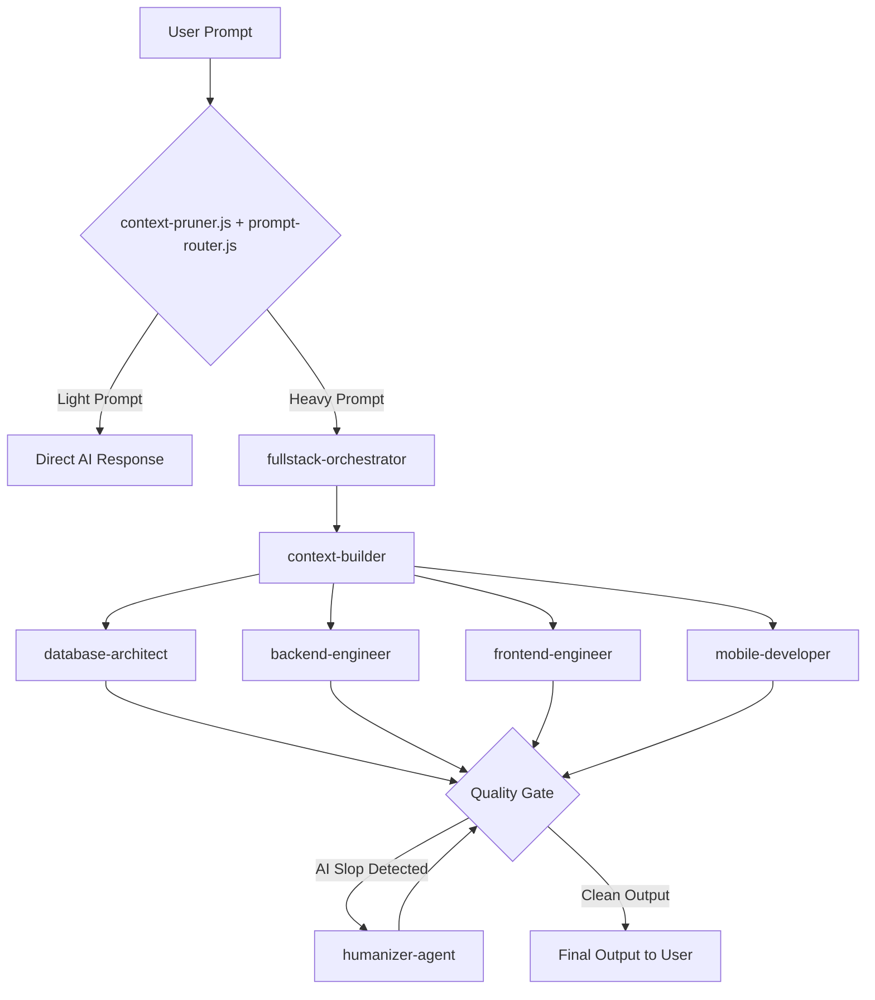

<p align="center">
  <strong>Universal Qwen Agentic Harness</strong>
</p>

<p align="center">
  <em>The Agent Harness Performance Optimization System for Qwen Code</em>
</p>

<p align="center">
  
  
  
  
</p>

<p align="center">
  
  
  
  
</p>

> [!WARNING]
> **Configure API keys securely.** This harness integrates with external APIs (DashScope, Tavily, GitHub, and others). Never hardcode API keys in your repository. Always use the `.qwen/settings.json` environment block or system environment variables.

<div align="center">

| [Quickstart](#quickstart)             | [Architecture](#architecture-flow)           | [Components](#core-components)          | [Commands](#slash-commands)     |
| ------------------------------------- | -------------------------------------------- | --------------------------------------- | ------------------------------- |
| Get up and running in under 2 minutes | How the Orchestrator-Worker system functions | 30 agents, 41 skills, 17 hooks, 15 MCPs | Force specific agent delegation |

</div>

---

## Universal Qwen Agentic Harness

Your agent can write code, but this harness gives it a coordinated engineering system and toolbox: it plans before it builds, delegates tasks to specialized sub-agents, reviews its own work from a fresh context, and enforces quality gates.

```text
prompt -> route -> orchestrate -> delegate -> verify -> humanize -> output
```

Instead of rebuilding this process in every prompt, you install it once and make it part of how your agent works.

> Optimize the context window. Persist everything else.

This harness is MIT-licensed open source. It works natively with the Qwen Code CLI, using an Orchestrator-Worker architecture driven by universal Node.js hooks.

| Included    | Count | What it gives you                                                                         |
| ----------- | ----: | ----------------------------------------------------------------------------------------- |
| Agents      |    30 | Management, programming, infrastructure, research, finance, and specialized work          |
| Skills      |    42 | AI core, programming, security, DevOps, research, finance, and system workflows           |
| Commands    |    15 | Slash commands for instant agent delegation                                               |
| Hooks       |    17 | Context pruning, prompt routing, security checks, quality enforcement, memory persistence |
| Rules       |    13 | Coding standards, output contracts, security baselines, execution protocols               |
| MCP servers |    15 | Web search, code research, GitHub, filesystem, browser automation, and more               |

---

## Quickstart

Get up and running in less than 2 minutes.

```bash
# 1. Clone the repository
git clone https://github.com/vansy11/universal-qwen-agentic-harness.git
cd universal-qwen-agentic-harness

# 2. Install MCP server dependencies globally
npm install -g @modelcontextprotocol/server-github @modelcontextprotocol/server-filesystem @modelcontextprotocol/server-memory @modelcontextprotocol/server-sequential-thinking @kazuph/mcp-fetch tavily-mcp exa-mcp-server

# 3. Configure your API keys
# Rename settings.example.json to .qwen/settings.json
# Open it and replace the placeholder values in the "env" block with your actual keys

# 4. Run Qwen Code
qwen
```

<details>
<summary><strong>Verifying your install</strong></summary>

After running `qwen`, confirm the harness loaded correctly:

```bash
# Check that hooks are registered
qwen --list-hooks

# Check that MCP servers respond
qwen --list-mcp
```

If either command comes back empty, double check that `.qwen/settings.json` exists and that the `env` block contains valid, non-placeholder API keys.
</details>

---

## Advanced Configuration

<details>
<summary><strong>Multi-provider support</strong></summary>

You can switch between DashScope (Alibaba), OpenAI, Moonshot, Google Gemini, and OpenRouter directly inside `settings.json`. Supports both standard and Token Plan models.

```json
{
  "modelProviders": {
    "bailian": {
      "type": "openai",
      "baseURL": "https://dashscope.aliyuncs.com/compatible-mode/v1",
      "apiKeyEnv": "DASHSCOPE_API_KEY",
      "models": {
        "deepseek-v3.2": { "contextWindow": 128000, "maxTokens": 8192 }
      }
    }
  }
}
```

Add additional provider blocks the same way, then point your active profile at the provider key you want to use.
</details>

<details>
<summary><strong>Universal Node.js hooks</strong></summary>

The hooks are written in pure Node.js (`.js`) rather than PowerShell (`.ps1`) to ensure full cross-platform compatibility (Windows, macOS, Linux) without execution policy issues.

| Hook                     | Type             | Purpose                                                        |
| ------------------------ | ---------------- | -------------------------------------------------------------- |
| `session-bootstrap.js`   | SessionStart     | Initialize session context and environment                     |
| `context-pruner.js`      | UserPromptSubmit | Prune context before prompt processing                         |
| `prompt-router.js`       | UserPromptSubmit | Analyzes prompt complexity and routes tasks to the right agent |
| `security-check.js`      | PreToolUse       | Blocks dangerous shell commands (for example, `rm -rf`)        |
| `trading-risk-guard.js`  | PreToolUse       | Guards trading operations against unauthorized execution       |
| `token-monitor.js`       | PostToolUse      | Track token consumption per turn                               |
| `lint-check.js`          | PostToolUse      | Auto-lint code after file writes                               |
| `auto-format.js`         | PostToolUse      | Auto-format code to project standards                          |
| `parent-silencer.js`     | MessageDisplay   | Silence parent conversation noise                              |
| `output-sanitizer.js`    | MessageDisplay   | Clean raw tool outputs from displayed messages                 |
| `subagent-presenter.js`  | SubagentStart    | Format subagent results for clean presentation                 |
| `hallucination-guard.js` | Stop             | Detect and flag potential hallucinations                       |
| `quality-gate.js`        | Stop             | Rejects robotic phrasing and forces human-like rewrites        |
| `auto-memory.js`         | Stop             | Persists learnings and patterns to long-term memory            |
| `improvement-tracker.js` | Stop             | Track and log system improvements                              |
| `protocol-updater.js`    | Stop             | Update protocol documentation based on changes                 |
| `reflection.js`          | Stop             | Self-reflect on session outcomes                               |

</details>

<details>
<summary><strong>Environment variables reference</strong></summary>

| Variable                     | Purpose                                                            |
| ---------------------------- | ------------------------------------------------------------------ |
| `DASHSCOPE_API_KEY`          | Authenticates DashScope / Alibaba Cloud model calls                |
| `TAVILY_API_KEY`             | Enables the `tavily` web search MCP server                         |
| `GITHUB_TOKEN`               | Enables the `github` MCP server for repo, PR, and issue management |
| `EXA_API_KEY`                | Enables the `exa` semantic search MCP server                       |
| `BRAVE_API_KEY`              | Enables the `brave-search` MCP server                              |
| `FIRECRAWL_API_KEY`          | Enables the `firecrawl` MCP server                                 |
| `SHODAN_API_KEY`             | Enables Shodan vulnerability scanning                              |
| `GEMINI_API_KEY`             | Authenticates Google Gemini model calls                            |
| `BAILIAN_TOKEN_PLAN_API_KEY` | Enables Token Plan discounted model access                         |

Store these in `.qwen/settings.json` under the `env` block, or export them as system environment variables. Never commit real values to version control.
</details>

---

## Architecture Flow

This system uses an Orchestrator-Worker architecture. Below is the flow of how a prompt is processed automatically by the hooks and agents.

```text
User Prompt
    → context-pruner.js + prompt-router.js (hooks)
        → Light prompt  → Direct AI response
        → Heavy prompt  → fullstack-orchestrator
                                → context-builder
                                    → database-architect
                                    → backend-engineer
                                    → frontend-engineer
                                    → mobile-developer
                                    → cloud-architect
                                → Stop hooks (quality-gate, auto-memory, reflection...)
                                    → AI slop detected → humanizer-agent → recheck
                                    → Clean output     → Final output to user
```

<details>
<summary><strong>Mermaid diagram</strong></summary>



</details>

---

## Core Components

<details>
<summary><strong>30 specialized agents</strong></summary>

| Category       | Agents                                                                                                                                                        |
| -------------- | ------------------------------------------------------------------------------------------------------------------------------------------------------------- |
| Management     | `context-builder`, `fullstack-orchestrator`, `memory-curator`, `humanizer`, `team-commander`                                                                  |
| Programming    | `database-architect`, `backend-engineer`, `frontend-engineer`, `mobile-developer`, `ui-ux-designer`, `code-reviewer`, `refactor-engineer`, `technical-writer` |
| Infrastructure | `cloud-architect`, `devops-engineer`, `network-engineer`, `execution-engineer`                                                                                |
| Security       | `cybersecurity-analyst`, `quality-gatekeeper`, `risk-manager`                                                                                                 |
| Data           | `data-engineer`, `market-data-engineer`                                                                                                                       |
| Research       | `web-researcher`, `news-trending-scout`, `social-media-analyst`                                                                                               |
| Finance        | `finance-analyst`, `quant-algo-engineer`, `quant-strategist`, `trading-desk-chief`                                                                            |
| Specialized    | `self-evaluator`                                                                                                                                              |

</details>

<details>
<summary><strong>41 technical skills</strong></summary>

| Category    | Skills                                                                                                                                                                                                                                             |
| ----------- | -------------------------------------------------------------------------------------------------------------------------------------------------------------------------------------------------------------------------------------------------- |
| AI Core     | `ai-humanizer-anti-slop`, `ai-memory-curator`, `prompt-router`, `fact-check-anti-hallucination`                                                                                                                                                    |
| Programming | `backend-api-design`, `database-ssd-design`, `frontend-react-tailwind`, `ui-animation-gsap-framer`, `ui-ux-design-system`, `api-doc-generator`, `api-testing`, `mobile-react-native`, `migration-refactoring`, `tdd-workflow`, `verification-loop` |
| Security    | `cybersecurity-pentest`, `cybersecurity-vuln-scan`, `code-review-security`                                                                                                                                                                         |
| DevOps      | `docker-deployment`, `git-workflow`, `github-workflow`, `network-diagnostics`, `monitoring-observability`, `performance-optimization`                                                                                                              |
| Data        | `data-visualization`, `etl-pipeline`                                                                                                                                                                                                               |
| Research    | `web-research-deep`, `news-trending-aggregator`, `api-integration-exa-tavily`, `social-media-monitor`                                                                                                                                              |
| Finance     | `finance-analysis`, `quant-algo-trading`                                                                                                                                                                                                           |
| System      | `fullstack-orchestration`, `workflow-automation`, `universal-execution-loop`, `error-resolution-loop`, `accessibility-audit`, `seo-optimization`, `technical-documentation`, `cloud-infrastructure`, `strategic-compact`                           |

</details>

<details>
<summary><strong>15 slash commands</strong></summary>

| Command       | Description                                                                  |
| ------------- | ---------------------------------------------------------------------------- |
| `/audit`      | Audit usage of agents, models, MCP servers, and skills harness               |
| `/backtest`   | Run backtest suite for a trading strategy with walk-forward validation       |
| `/deploy`     | Deploy application to production or staging environment                      |
| `/erd`        | Generate Entity Relationship Diagram from database schema or requirements    |
| `/eval`       | Run routing regression evals to measure harness precision                    |
| `/fullstack`  | Build complete full-stack feature from requirements to deployment            |
| `/git-push`   | Stage, commit, and push changes with conventional commit message             |
| `/humanize`   | Rewrite AI-generated text to sound natural and human                         |
| `/pentest`    | Run security penetration test on target application or infrastructure        |
| `/quant`      | Design and implement quantitative trading algorithm                          |
| `/research`   | Conduct deep web research with multi-source synthesis and fact verification  |
| `/review`     | Review changed code for correctness, security, code quality, and performance |
| `/risk-check` | Validate current positions and parameters against risk rules                 |
| `/route`      | Analyze prompt and route to optimal agent/skill combination                  |
| `/trend`      | Aggregate trending news and sentiment for specified topic or market          |

</details>

<details>
<summary><strong>17 universal hooks</strong></summary>

- `session-bootstrap.js`: Session initialization and context setup
- `context-pruner.js`: Prunes conversation context before prompt processing
- `prompt-router.js`: Analyzes prompt complexity and maps tasks to target agents
- `security-check.js`: PreToolUse hook that blocks dangerous shell commands (`rm -rf`, `git push --force`, etc.)
- `trading-risk-guard.js`: PreToolUse hook for trading operation validation
- `token-monitor.js`: Tracks token consumption across tool use
- `lint-check.js`: PostToolUse hook for auto-linting code after writes
- `auto-format.js`: PostToolUse hook for auto-formatting code to standards
- `parent-silencer.js`: Filters parent conversation noise during message display
- `output-sanitizer.js`: Cleans raw tool outputs from user-facing messages
- `subagent-presenter.js`: Formats subagent results for clean presentation
- `hallucination-guard.js`: Flags potential hallucinations in responses
- `quality-gate.js`: Rejects robotic phrasing and forces human-like rewrites
- `auto-memory.js`: Persists learnings to long-term memory
- `improvement-tracker.js`: Logs systemic improvements over time
- `protocol-updater.js`: Syncs protocol docs with recent changes
- `reflection.js`: Self-evaluates session outcomes
- `memory-distiller.py`: Distills context into compact memory before compaction

</details>

<details>
<summary><strong>15 MCP server integrations</strong></summary>

| Server                | Purpose                                               |
| --------------------- | ----------------------------------------------------- |
| `tavily`              | Real-time web search and news                         |
| `exa`                 | Semantic search for code and academic research        |
| `brave-search`        | Privacy-focused web search (2,000 free queries/month) |
| `web-research`        | Automated web research via headless browser           |
| `github`              | Repository management, pull requests, and issues      |
| `filesystem`          | Secure local file read and write access               |
| `fetch`               | Raw URL content retrieval (web scraping)              |
| `memory`              | Knowledge graph for long-term AI memory               |
| `sequential-thinking` | Complex problem decomposition tool                    |
| `playwright`          | Browser automation and E2E testing                    |
| `context7`            | Live documentation lookup for libraries               |
| `magic`               | Magic UI components for frontend animations           |
| `vercel`              | Cloud deployment and project management               |
| `firecrawl`           | Advanced web scraping and crawling                    |
| `Parallel Search MCP` | Parallel AI search integration                        |

</details>

---

## Slash Commands

Force specific agent delegation instantly using the built-in commands.

| Command       | Description                                                    |
| ------------- | -------------------------------------------------------------- |
| `/audit`      | Audit usage of agents, models, MCP servers, and skills         |
| `/backtest`   | Run backtest suite for trading strategy validation             |
| `/deploy`     | Generate Dockerfile + docker-compose with health checks        |
| `/erd`        | Generate Entity-Relationship Diagram for current database      |
| `/eval`       | Run routing regression evals to measure harness precision      |
| `/fullstack`  | Run the full-stack chain (database, backend, frontend, mobile) |
| `/git-push`   | Safely commit and push the project to GitHub                   |
| `/humanize`   | Clean up the AI's last response to sound more human            |
| `/pentest`    | Run a security scan on the current codebase                    |
| `/quant`      | Build and backtest a trading strategy                          |
| `/research`   | Force the `web-researcher` agent to search the internet        |
| `/review`     | Code review for correctness, security, and quality             |
| `/risk-check` | Validate trading positions against risk rules                  |
| `/route`      | Route prompt to optimal agent/skill                            |
| `/trend`      | Aggregate trending news and sentiment                          |

---

## Why Use This Harness

| Without a system                                  | With this harness                                             |
| ------------------------------------------------- | ------------------------------------------------------------- |
| Every prompt reinvents the same planning steps    | Planning, delegation, and review are part of the default flow |
| One context window writes and checks its own work | Sub-agents review output from a fresh context                 |
| Quality depends on remembering to ask for it      | `quality-gate.js` enforces anti-slop checks automatically     |
| Dangerous shell commands can slip through         | `security-check.js` blocks risky commands before execution    |
| Switching model providers means rewriting prompts | Provider swaps happen in `settings.json`, not in your prompts |
| No persistent memory across sessions              | `auto-memory.js` persists learnings automatically             |
| No visibility into token usage                    | `token-monitor.js` tracks consumption per turn                |
| Hallucinations go unchecked                       | `hallucination-guard.js` flags unverified claims              |
| Documentation drifts out of sync                  | `protocol-updater.js` keeps docs aligned with changes         |

---

## Troubleshooting

<details>
<summary><strong>MCP servers are not responding</strong></summary>

1. Confirm the packages installed correctly: `npm ls -g --depth=0` and check for each `@modelcontextprotocol/server-*` package plus `@kazuph/mcp-fetch`, `tavily-mcp`, and `exa-mcp-server`.
2. Confirm the matching API key exists in `.qwen/settings.json` under `env`.
3. Restart Qwen Code after any settings change.

</details>

<details>
<summary><strong>My API keys are not being picked up</strong></summary>

- Confirm the file is named `.qwen/settings.json`, not `settings.example.json`.
- Confirm there are no trailing commas or syntax errors in the JSON file.
- Environment variables set at the system level take priority only if the matching key in `settings.json` is left empty.

</details>

<details>
<summary><strong>The orchestrator is not delegating to sub-agents</strong></summary>

Check that `prompt-router.js` is registered as a UserPromptSubmit hook. Heavy prompts route to `fullstack-orchestrator` only when the router classifies them as such; short or narrow prompts intentionally get a direct response instead.
</details>

---

## Features

- **30 specialized agents** spanning management, programming, infrastructure, research, finance, and security
- **42 technical skills** for rapid development across AI, security, DevOps, and full-stack workflows
- **15 slash commands** for instant agent delegation
- **17 universal hooks** for automatic context pruning, prompt routing, security enforcement, quality gating, and memory persistence
- **13 rule sets** covering coding standards, output contracts, security baselines, and execution protocols
- **15 MCP integrations** covering web search, GitHub, filesystem, memory, browser automation, and more

## Installation

```bash
git clone https://github.com/vansy11/universal-qwen-agentic-harness.git
npm install -g @modelcontextprotocol/server-github @modelcontextprotocol/server-filesystem @modelcontextprotocol/server-memory @modelcontextprotocol/server-sequential-thinking @kazuph/mcp-fetch tavily-mcp exa-mcp-server
```

Configure API keys in `.qwen/settings.json` and run `qwen` to activate the harness.

## Commands

| Command      | Description                                                        |
| ------------ | ------------------------------------------------------------------ |
| `/fullstack` | End-to-end app generation (database → backend → frontend → mobile) |
| `/research`  | Deep web research with cross-source verification                   |
| `/pentest`   | Vulnerability scan with OWASP Top 10 checklist                     |
| `/deploy`    | Generate Dockerfile + docker-compose with health checks            |
| `/erd`       | Generate Entity-Relationship Diagram for current database          |
| `/quant`     | Build and backtest quantitative trading strategies                 |
| `/backtest`  | Run walk-forward validation on trading strategies                  |
| `/review`    | Code review with security and quality checks                       |

## License

MIT License — see `LICENSE` for details.

<div align="center">

Built by <strong>Vansy</strong> using Qwen Code

</div>
