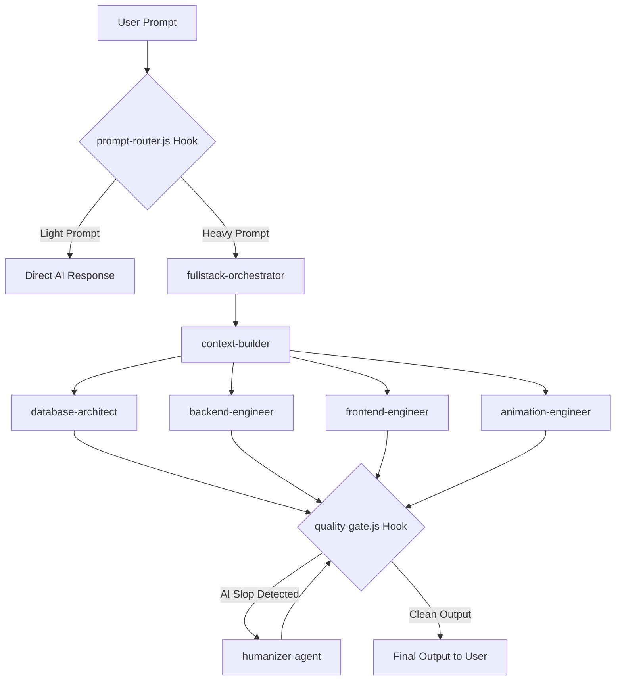

<p align="center">
  <strong>Universal Qwen Agentic Harness</strong>
</p>

<p align="center">
  <em>The Agent Harness Performance Optimization System for Qwen Code</em>
</p>

<p align="center">
  
  
  
  
</p>

<p align="center">
  
  
  
  
</p>

> [!WARNING]
> **Configure API keys securely.** This harness integrates with external APIs (DashScope, Tavily, GitHub, and others). Never hardcode API keys in your repository. Always use the `.qwen/settings.json` environment block or system environment variables.

<div align="center">

| [Quickstart](#quickstart) | [Architecture](#architecture-flow) | [Components](#core-components) | [Commands](#slash-commands) |
|---|---|---|---|
| Get up and running in under 2 minutes | How the Orchestrator-Worker system functions | 18 agents, 24 skills, 3 hooks, 7 MCPs | Force specific agent delegation |

</div>

---

## Universal Qwen Agentic Harness

Your agent can write code, but this harness gives it a coordinated engineering system and toolbox: it plans before it builds, delegates tasks to specialized sub-agents, reviews its own work from a fresh context, and enforces quality gates.

```text
prompt -> route -> orchestrate -> delegate -> verify -> humanize -> output
```

Instead of rebuilding this process in every prompt, you install it once and make it part of how your agent works.

> Optimize the context window. Persist everything else.

This harness is MIT-licensed open source. It works natively with the Qwen Code CLI, using an Orchestrator-Worker architecture driven by universal Node.js hooks.

| Included | Count | What it gives you |
|---|---:|---|
| Agents | 18 agents | Management, programming, infrastructure, research, and finance work |
| Skills | 24 skills | AI core, programming, security, DevOps, research, and finance workflows |
| Hooks | 3 hooks | Prompt routing, command safety checks, and output quality enforcement |
| MCP servers | 7 integrations | Web search, code research, GitHub, filesystem, fetch, memory, reasoning |

---

## Quickstart

Get up and running in less than 2 minutes.

```bash
# 1. Clone the repository
git clone https://github.com/vansy11/universal-qwen-agentic-harness.git
cd universal-qwen-agentic-harness

# 2. Install MCP server dependencies globally
npm install -g @modelcontextprotocol/server-github @modelcontextprotocol/server-filesystem @modelcontextprotocol/server-memory @modelcontextprotocol/server-sequential-thinking @kazuph/mcp-fetch tavily-mcp exa-mcp-server

# 3. Configure your API keys
# Rename settings.example.json to .qwen/settings.json
# Open it and replace the placeholder values in the "env" block with your actual keys

# 4. Run Qwen Code
qwen
```

<details>
<summary><strong>Verifying your install</strong></summary>

After running `qwen`, confirm the harness loaded correctly:

```bash
# Check that hooks are registered
qwen --list-hooks

# Check that MCP servers respond
qwen --list-mcp
```

If either command comes back empty, double check that `.qwen/settings.json` exists and that the `env` block contains valid, non-placeholder API keys.
</details>

---

## Advanced Configuration

<details>
<summary><strong>Multi-provider support</strong></summary>

You can switch between DashScope (Alibaba), OpenAI, Moonshot, and OpenRouter directly inside `settings.json`.

```json
{
  "modelProviders": {
    "bailian": {
      "type": "openai",
      "baseURL": "https://dashscope.aliyuncs.com/compatible-mode/v1",
      "apiKeyEnv": "DASHSCOPE_API_KEY",
      "models": {
        "deepseek-v3.2": { "contextWindow": 128000, "maxTokens": 8192 }
      }
    }
  }
}
```

Add additional provider blocks the same way, then point your active profile at the provider key you want to use.
</details>

<details>
<summary><strong>Universal Node.js hooks</strong></summary>

The hooks are written in pure Node.js (`.js`) rather than PowerShell (`.ps1`) to ensure full cross-platform compatibility (Windows, macOS, Linux) without execution policy issues.

| Hook | Type | Purpose |
|---|---|---|
| `prompt-router.js` | PreToolUse | Analyzes prompt complexity and routes tasks to the right agent |
| `security-check.js` | PreToolUse | Blocks dangerous shell commands (for example, `rm -rf`) |
| `quality-gate.js` | Stop | Rejects robotic phrasing and forces human-like rewrites |
</details>

<details>
<summary><strong>Environment variables reference</strong></summary>

| Variable | Purpose |
|---|---|
| `DASHSCOPE_API_KEY` | Authenticates DashScope / Alibaba Cloud model calls |
| `TAVILY_API_KEY` | Enables the `tavily` web search MCP server |
| `GITHUB_TOKEN` | Enables the `github` MCP server for repo, PR, and issue management |
| `EXA_API_KEY` | Enables the `exa` semantic search MCP server |

Store these in `.qwen/settings.json` under the `env` block, or export them as system environment variables. Never commit real values to version control.
</details>

---

## Architecture Flow

This system uses an Orchestrator-Worker architecture. Below is the flow of how a prompt is processed automatically by the hooks and agents.

```text
User Prompt
    -> prompt-router.js (hook)
        -> Light prompt  -> Direct AI response
        -> Heavy prompt  -> fullstack-orchestrator
                                -> context-builder
                                    -> database-architect
                                    -> backend-engineer
                                    -> frontend-engineer
                                    -> animation-engineer
                                -> quality-gate.js (hook)
                                    -> AI slop detected -> humanizer-agent -> quality-gate.js (recheck)
                                    -> Clean output     -> Final output to user
```

<details>
<summary><strong>Mermaid diagram</strong></summary>


</details>

---

## Core Components

<details>
<summary><strong>18 specialized agents</strong></summary>

| Category | Agents |
|---|---|
| Management | `context-builder`, `fullstack-orchestrator`, `memory-curator`, `humanizer` |
| Programming | `database-architect`, `backend-engineer`, `frontend-engineer`, `ui-ux-designer`, `animation-engineer`, `code-reviewer` |
| Infrastructure | `cybersecurity-analyst`, `network-engineer`, `devops-engineer` |
| Research | `web-researcher`, `news-trending-scout`, `social-media-analyst` |
| Finance | `finance-analyst`, `quant-algo-engineer` |
</details>

<details>
<summary><strong>24 technical skills</strong></summary>

| Category | Skills |
|---|---|
| AI core | `ai-humanizer-anti-slop`, `ai-memory-curator`, `prompt-router` |
| Programming | `backend-api-design`, `database-ssd-design`, `frontend-react-tailwind`, `ui-animation-gsap-framer`, `api-doc-generator` |
| Security | `cybersecurity-pentest`, `cybersecurity-vuln-scan`, `code-review-security` |
| DevOps | `docker-deployment`, `github-workflow`, `network-diagnostics` |
| Research | `web-research-deep`, `news-trending-aggregator`, `api-integration-exa-tavily`, `social-media-monitor` |
| Finance | `finance-analysis`, `quant-algo-trading` |
| System | `fullstack-orchestration`, `workflow-automation` |
</details>

<details>
<summary><strong>3 universal Node.js hooks</strong></summary>

- `prompt-router.js`: analyzes prompt complexity and maps tasks to target agents.
- `security-check.js`: PreToolUse hook that blocks dangerous shell commands (for example, `rm -rf`).
- `quality-gate.js`: Stop hook that acts as an anti-AI-slop enforcer, rejecting robotic phrasing and forcing human-like rewrites.
</details>

<details>
<summary><strong>7 MCP server integrations</strong></summary>

| Server | Purpose |
|---|---|
| `tavily` | Real-time web search and news |
| `exa` | Semantic search for code and academic research |
| `github` | Repository management, pull requests, and issues |
| `filesystem` | Secure local file read and write access |
| `fetch` | Raw URL content retrieval (web scraping) |
| `memory` | Knowledge graph for long-term AI memory |
| `sequential-thinking` | Complex problem decomposition tool |
</details>

---

## Slash Commands

Force specific agent delegation instantly using the built-in commands.

| Command | Description |
|---|---|
| `/fullstack` | Run the full-stack chain (database, backend, frontend, animation) |
| `/research` | Force the `web-researcher` agent to search the internet |
| `/pentest` | Run a security scan on the current codebase |
| `/git-push` | Safely commit and push the project to a new GitHub repository |
| `/humanize` | Clean up the AI's last response to sound more human |
| `/quant` | Build and backtest a trading strategy |

---

## Why Use This Harness

| Without a system | With this harness |
|---|---|
| Every prompt reinvents the same planning steps | Planning, delegation, and review are part of the default flow |
| One context window writes and checks its own work | Sub-agents review output from a fresh context |
| Quality depends on remembering to ask for it | `quality-gate.js` enforces anti-slop checks automatically |
| Dangerous shell commands can slip through | `security-check.js` blocks risky commands before execution |
| Switching model providers means rewriting prompts | Provider swaps happen in `settings.json`, not in your prompts |

---

## Troubleshooting

<details>
<summary><strong>MCP servers are not responding</strong></summary>

1. Confirm the packages installed correctly: `npm ls -g --depth=0` and check for each `@modelcontextprotocol/server-*` package plus `@kazuph/mcp-fetch`, `tavily-mcp`, and `exa-mcp-server`.
2. Confirm the matching API key exists in `.qwen/settings.json` under `env`.
3. Restart Qwen Code after any settings change.
</details>

<details>
<summary><strong>My API keys are not being picked up</strong></summary>

- Confirm the file is named `.qwen/settings.json`, not `settings.example.json`.
- Confirm there are no trailing commas or syntax errors in the JSON file.
- Environment variables set at the system level take priority only if the matching key in `settings.json` is left empty.
</details>

<details>
<summary><strong>The orchestrator is not delegating to sub-agents</strong></summary>

Check that `prompt-router.js` is registered as a PreToolUse hook. Heavy prompts route to `fullstack-orchestrator` only when the router classifies them as such; short or narrow prompts intentionally get a direct response instead.
</details>

---

## Features

- **18 specialized agents** spanning management, programming, infrastructure, research, and finance
- **24 technical skills** for rapid development across AI, security, DevOps, and full-stack workflows
- **3 universal hooks** for automatic prompt routing, security enforcement, and quality gating
- **7 MCP integrations** covering web search, GitHub, filesystem, memory, and reasoning

## Installation

```bash
git clone https://github.com/vansy11/universal-qwen-agentic-harness.git
npm install -g @modelcontextprotocol/server-github @modelcontextprotocol/server-filesystem @modelcontextprotocol/server-memory @modelcontextprotocol/server-sequential-thinking @kazuph/mcp-fetch tavily-mcp exa-mcp-server
```

Configure API keys in `.qwen/settings.json` and run `qwen` to activate the harness.

## Commands

| Command | Description |
|---|---|
| `/fullstack` | End-to-end app generation (database → backend → frontend → animation) |
| `/research` | Deep web research with cross-source verification |
| `/pentest` | Vulnerability scan with OWASP Top 10 checklist |
| `/deploy` | Generate Dockerfile + docker-compose with health checks |
| `/erd` | Generate Entity-Relationship Diagram for current database |
| `/quant` | Build and backtest quantitative trading strategies |
| `/simplify` | Post-implementation cleanup pass on recent changes |

## License

MIT License — see `LICENSE` for details.

<div align="center">

Built by <strong>Vansy</strong> using Qwen Code

</div>