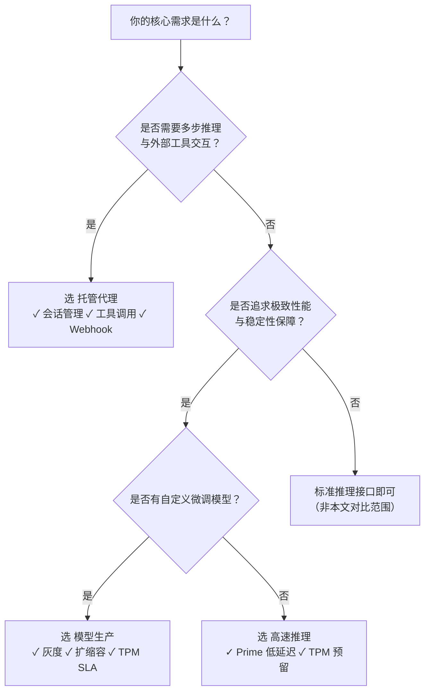

# [模型部署](../concepts/model-deployment.md)方式对比：托管代理、高速推理与模型生产

为帮助开发者在百炼平台上高效、可靠地将 AI 能力投入实际业务，平台提供了三种面向不同抽象层级与运维诉求的模型服务化路径：**托管代理（Managed Agents）**、**高速推理（Model High-Speed Inference）** 和 **模型生产（Model Production）**。本文旨在系统性对比三者的核心能力边界、技术约束与适用场景，辅助团队基于业务目标（如是否需要多步编排、是否追求极致延迟、是否需自主模型迭代）做出精准的技术选型决策。

---

## 关键维度对比

| 维度 | 托管代理（Managed Agents） | 高速推理（Model High-Speed Inference） | 模型生产（Model Production） |
|------|-----------------------------|------------------------------------------|-------------------------------|
| **定位与抽象层级** | **面向业务逻辑的智能体编排层**：封装多步推理、工具调用、会话状态管理等复杂流程，提供声明式 Agent 运行时 | **面向性能保障的推理加速层**：在标准模型 API 基础上叠加资源隔离与调度优化，提升吞吐与稳定性 | **面向 MLOps 的模型服务治理层**：支持自定义训练/调优模型的全生命周期部署、灰度、扩缩容与 SLA 保障 |
| **输入格式** | JSON 对象，严格遵循 Agent 定义中 `input_schema` 的结构（如 `{"query": "…", "user_id": "…"}`） | 标准文本生成请求体（如 `{"model": "qwen-max", "input": {"messages": [...]}}`），支持 `parameters` 扩展字段 | 标准模型服务请求体（同高速推理），但必须通过 `/v1/model-productions/{id}` 创建的专属端点调用 |
| **输出格式** | 同步返回含 `status`、`output`、`session_id` 的 JSON；异步场景下支持 Webhook 事件流（`tool_called`, `session_completed` 等） | 同步返回标准 `text-generation` 响应（含 `output.text`, `usage`）；**不支持流式响应（`stream: true`）与 Prime 模式共用** | 同步返回标准模型响应；支持灰度路由头（`X-Version-Alias`）和扩缩容指标透出（`X-Actual-TPM`） |
| **支持模型** | 仅限平台预置 Qwen 系列：`qwen-max`、`qwen-plus`、`qwen-turbo`（不可替换或 BYOM） | 仅限百炼托管模型（Qwen 系列、Qwen-VL、Qwen-Audio），**不支持用户自定义模型** | ✅ 支持所有已完成调优/部署的百炼模型（含自定义微调模型 ID，如 `qwen-max-20240601-001`） |
| **API 端点** | `POST /v1/agents/{agent_id}/sessions`（会话级入口） | `POST /v1/services/aigc/text-generation/generation`（需在 `parameters` 中启用 `enable_prime` 或 `tpm_reservation`） | `POST /v1/model-productions/{production_id}/inference`（专属生产实例端点） |
| **计费方式** | 按 **Agent 会话执行时长（秒） + token 消耗量** 计费；会话超时（>600s）或上下文截断均触发计费 | 按 **实际 token 消耗量** 计费；**TPM 预留部分按小时单独计费（未用不退）** | 按 **实际 token 消耗量 + TPM 预留费用（可选）** 计费；自动扩缩容实例按实际运行时长计费 |
| **核心能力** | ✅ 多轮会话上下文隔离（`session_id`） ✅ 内置工具调用与结果编排 ✅ Webhook 事件驱动（`agent_started`, `tool_called`） ❌ 不支持模型替换、参数动态覆盖 | ✅ Prime 模式（降低首 token 延迟） ✅ TPM 预留（保障稳定 QPS） ❌ 不支持工具调用、无状态编排 ❌ 不支持流式响应（启用 Prime 时） | ✅ TPM 预留（SLA 可承诺） ✅ 灰度发布（按 `version_alias` 流量分发） ✅ 自动扩缩容（基于 `actual_tpm`） ❌ 不提供内置工具链或会话管理 |
| **典型场景** | 客服对话机器人（需查订单+改地址+发通知）、数据分析助手（需连 BI 工具+生成图表+总结结论）、审批工作流（多角色协同+状态持久化） | 高并发实时问答（如 App 内搜索补全）、批量内容生成（万级文案合成）、低延迟语音转写服务 | 金融风控模型 A/B 测试、电商推荐模型灰度上线、企业私有知识库微调模型的生产化部署 |

---

## 适用场景建议（面向开发者）

| 场景特征 | 推荐方案 | 关键理由 |
|----------|-----------|-----------|
| **需要“调用外部系统 + 多步决策 + 记住上下文”**（例如：用户说“帮我订明天去上海的高铁票，再查下酒店”，Agent 需依次调用购票 API、酒店搜索 API、汇总结果） | ✅ 托管代理 | 唯一支持声明式工具集成、会话状态自动维护、事件回调的方案；无需自行实现状态存储与错误重试逻辑。 |
| **已有成熟 [Prompt 工程](../concepts/prompt-engineering.md)，仅需更高并发、更低延迟的纯文本生成服务**（例如：千人同时使用的写作助手、日均百万次的摘要生成任务） | ✅ 高速推理 | Prime 模式显著降低 P99 延迟，TPM 预留避免共享队列抖动；配置简单（仅加两个参数），零代码改造即可接入现有 SDK。 |
| **使用了百炼模型调优功能，产出专属模型版本，需长期稳定服务并支持灰度/扩缩容**（例如：微调后的法律合同审查模型上线生产，要求 99.95% 可用率、支持 10% 流量灰度验证新版本） | ✅ 模型生产 | 唯一支持 `version_alias` 灰度、`auto_scaling_enabled` 动态扩缩、`tpm_reserved` SLA 承诺的方案；与调优/部署 API 深度打通，符合 MLOps 规范。 |
| **需混合使用多种模型（如先用 qwen-vl 看图，再用 qwen-max 写报告），且要统一监控与计费** | ⚠️ 需组合方案 | 单一方案无法满足：托管代理不支持多模态模型；高速推理与模型生产虽支持 Qwen-VL，但缺乏跨模型编排能力。建议以 **模型生产部署各子模型 + 托管代理作为顶层编排层**（通过 HTTP 工具调用各 production 端点）。 |
| **快速 PoC 验证模型效果，无长期运维诉求** | ✅ 高速推理（首选）或 托管代理（若需简单工具） | 高速推理开箱即用，控制台勾选即生效；托管代理适合需快速验证带工具链的 Agent 流程，避免从零搭建后端服务。 |

---

## 技术选型决策树（简明版）

> 💡 **重要提醒**：  
> - **不要混用概念**：托管代理 ≠ 模型生产 —— 前者是“运行时编排框架”，后者是“模型服务治理框架”；二者可协同（Agent 调用 production 端点），但不可替代。  
> - **计费敏感场景请验证**：TPM 预留费用独立于 token 计费，高波动流量下可能成本高于标准推理；建议用 [百炼成本计算器](https://help.aliyun.com/zh/bailian/cost-calculator) 模拟。  
> - **安全合规要求高时**：托管代理与模型生产均支持 VPC 内网访问与审计日志导出（需配置 Webhook 或 SLS），高速推理暂不支持内网专属 endpoint。  

如需进一步评估具体业务负载下的性能基线或定制化部署方案，欢迎联系百炼技术支持团队获取《生产环境部署最佳实践白皮书》。

## 被对比主题页

- [managed agents](../guides/managed-agents.md)
- [model high speed inference](../guides/model-high-speed-inference.md)
- [model production](../api/model-production.md)

